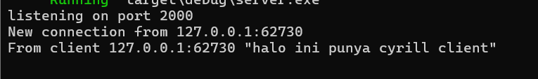
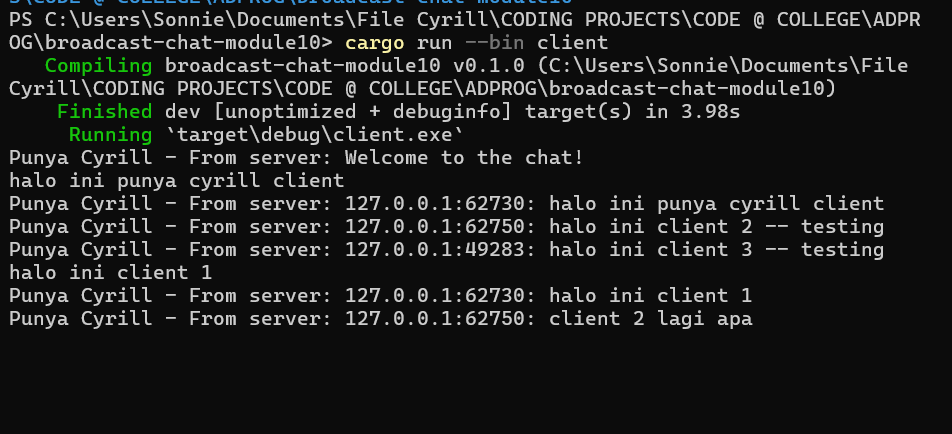
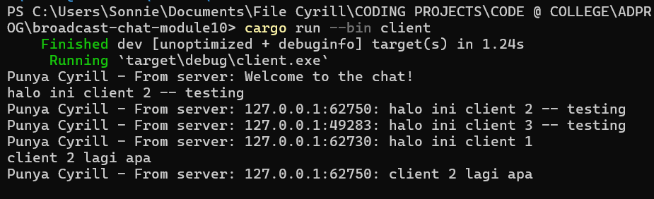
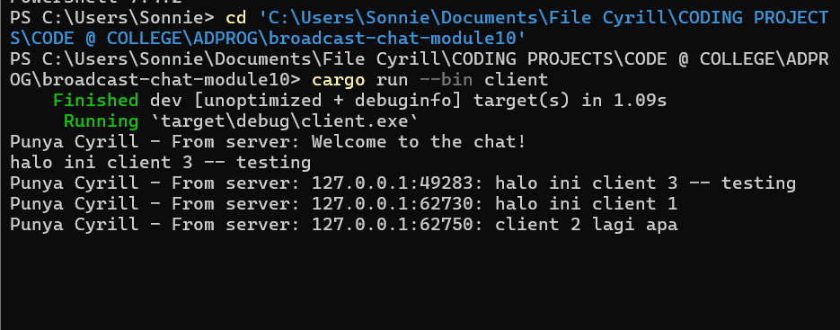
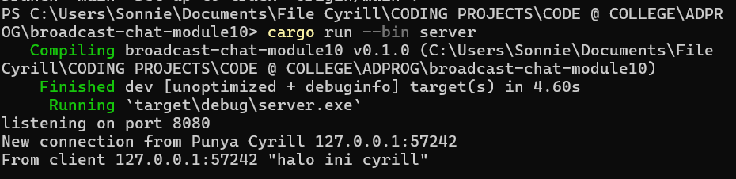

# Original code and how it works
## Server 

## Client 1 

## Client 2 

## Client 3 

# Modifying Ports
The parts that needed to be change is the listener part of the `server.rs` aside from the websocket protocol. 

# Small Changes 

This step we add information of the sender for every client in IP and Port. The small changes are made in the `bcast_tx.send` format in `server.rs`